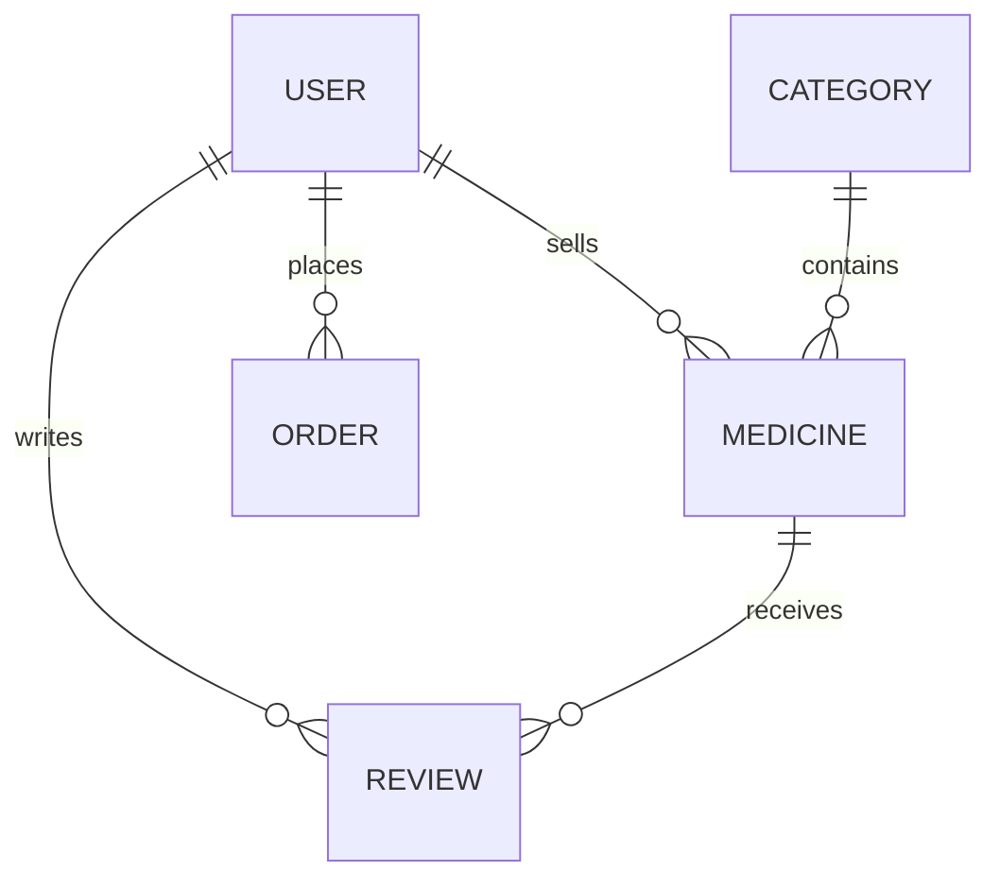

<div align="center">
  
  <h1>💊 HealiO</h1>
  <p><strong>The Ultimate Healthcare E-commerce Engine</strong></p>

  [](https://www.prisma.io/)
  [](https://www.typescriptlang.org/)
  [](https://nodejs.org/)
  [](https://expressjs.com/)
  [](https://www.postgresql.org/)
  [](https://better-auth.com/)
</div>

---

## ⚡ Overview

**Healio** is a high-performance, enterprise-ready healthcare e-commerce backend. It's designed with a modular architecture to handle complex medicine inventories, secure user roles, and seamless order fulfillment.

> [!IMPORTANT]
> This repository contains the **Core Backend Engine**. Check the frontend repository for the User Interface.

## 🛠️ The Tech Stack (Boss Level)

| Layer | Technology | Why we used it? |
| :--- | :--- | :--- |
| **Runtime** | `Node.js` | Industry-standard async I/O. |
| **Language** | `TypeScript` | Type safety for mission-critical health data. |
| **Framework** | `Express.js (v5)` | Latest features and improved error handling. |
| **ORM** | `Prisma` | Type-safe migrations and intuitive data modeling. |
| **Database** | `PostgreSQL` | Relational integrity for orders and inventory. |
| **Security** | `Better-Auth` | Modern authentication with OAuth support. |
| **Notifier** | `Nodemailer` | Reliable transactional email delivery. |

## 🚀 Key Features

- 🛡️ **Role-Based Access Control (RBAC)**: Fine-grained permissions for `CUSTOMER`, `SELLER`, and `ADMIN`.
- 🔑 **Multi-Provider Auth**: Secure login via Email/Password or **Google OAuth**.
- 📦 **Inventory Management**: Real-time stock tracking and manufacturer auditing.
- 🛒 **Dynamic Order System**: Persistent cart data and status tracking (Placed → Delivered).
- 💬 **User Feedback Loop**: Integrated Rating & Review system for product quality assurance.
- 🏗️ **Robust Architecture**: Modular folder structure for scalability.

## 📊 Database Architecture

Our schema is optimized for relational performance and extensibility.

👉 **[Healio ERD Visualizer](https://dbdiagram.io/d/Healio-Assignment-4-Programming-Hero-69785e4bbd82f5fce2b5acdb)**



## ⚙️ Quick Start

### 1. Prerequisites
- Node.js 18+
- PostgreSQL Instance

### 2. Installation & Setup
```bash
# Clone and enter
git clone https://github.com/HabiburRahmanZihad/Healio-web-Backend.git
cd Healio-web-Backend

# Install dependencies
npm install

# Setup Environment
cp .env.example .env # Then fill in your secrets
```

### 3. Database Sync
```bash
npx prisma migrate dev
```

### 4. Ignite the Server
```bash
# Production Mode
npm start

# Developer Mode (with reload)
npm run dev
```

## 🏗️ Project Structure
```text
src/
├── controllers/    # Request handling logic
├── middlewares/    # Auth & validation guards
├── routes/         # API endpoint definitions
├── services/       # Business logic layer
├── scripts/        # Seeding & maintenance tools
└── server.ts       # Application entry point
```

## 🤝 Contribution
1. Fork the repo.
2. Create your Feature Branch (`git checkout -b feature/AmazingFeature`).
3. Commit your changes (`git commit -m 'Add AmazingFeature'`).
4. Push to the Branch (`git push origin feature/AmazingFeature`).
5. Open a Pull Request.

---
<div align="center">
  Built with precision by <strong><a href="https://github.com/HabiburRahmanZihad">Habibur Rahman Zihad</a></strong>
</div>
