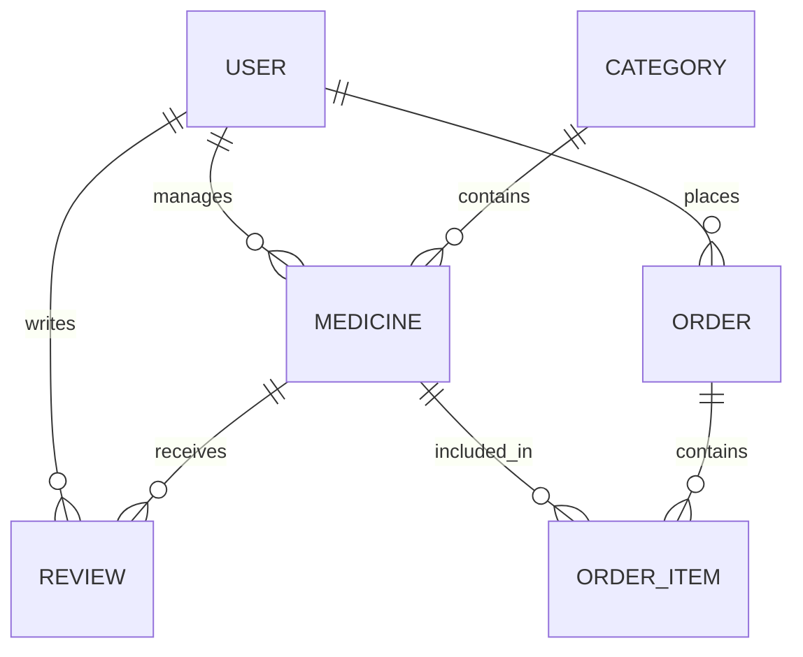

<div align="center">
    
  <h1>⚙️ HEALIO BACKEND</h1>
  <p><strong>The High-Performance Core Engine for Modern Healthcare</strong></p>

  <p>
    
    
    
    
    
  </p>
</div>

---

## ⚡ Overview

The **Healio Backend** is an enterprise-ready healthcare e-commerce engine designed for speed, security, and scalability. It serves as the "System Core" for the Healio Nexus, handling mission-critical health data, complex order fulfillment, and multi-role access control.

> [!TIP]
> For interactive API exploration, refer to our [Postman Testing Guide](POSTMAN_TESTING.md).

---

## 🛡️ Technical Architecture

Healio uses a modular, role-based architecture to ensure relational integrity and high availability.

### 🛠️ The Tech Stack
| Layer | technology | Rationale |
| :--- | :--- | :--- |
| **Logic** | `Express.js (v5)` | Fast, minimalist, and robust request handling. |
| **Database** | `PostgreSQL` | Relational consistency for healthcare inventories. |
| **ORM** | `Prisma` | Type-safe migrations and intuitive data modeling. |
| **Auth** | `Better-Auth` | Modern, secure authentication with multi-provider support. |
| **Mailer** | `Nodemailer` | Reliable transactional email delivery for system alerts. |
| **Validation** | `Zod` | Schema-driven data validation for zero-compromise security. |

---

## 🚀 Key Modules & Features

### 🔐 System Security (RBAC)
- **Granular Permissions**: Fine-grained access control for `ADMIN`, `SELLER`, and `CUSTOMER`.
- **Session Intelligence**: Secure session management with automated refresh protocols.
- **Identity Link**: Cross-node identity verification via Better-Auth.

### 📦 Pharmaceutical Inventory Matrix
- **Audited Listings**: Real-time stock tracking with manufacturer and category auditing.
- **Flash Sale Logic**: Specialized pricing overrides for synchronized sales events.
- **Category Hierarchy**: Recursive category management for complex medicine taxonomies.

### 🛒 Fiscal & Order Protocols
- **Transaction Integrity**: ACID-compliant order processing via PostgreSQL transactions.
- **Lifecycle Tracking**: Precise order status management (Placed → Processing → Shipped → Delivered).
- **Revenue Analytics**: Real-time aggregation of fiscal data for Admin Command Center.

---

## 📊 Data Modeling (Mermaid)



---

## 📂 System Structure
```text
src/
├── app.ts          # Core application configuration
├── server.ts       # Main entry point & port binding
├── config/         # Environment & System constants
├── controllers/    # Request processing & signal logic
├── middlewares/    # Security & Validation guards
├── modules/        # Feature-specific business logic
├── lib/            # Shared libraries (Prisma Node, Auth Node)
└── scripts/        # Seeding & Maintenance automation
```

---

## ⚙️ Deployment & Scaling

### 1. Prerequisites
- Node.js 18+ & npm/pnpm
- PostgreSQL Instance (Local or Cloud)

### 2. Ignition Flow
```bash
npm install                     # Install dependencies
cp .env.example .env            # Configure environmental variables
npx prisma migrate dev          # Sync database schema
npm run dev                     # Start development engine
```

### 3. Production Seeding
To initialize the system with an administrative account:
```bash
# Ensure ALLOW_ADMIN_SIGNUP=true in .env
npm run seed:admin
```

---

## 📄 License & Creator

Developed with 💎 Precision & ❤️ Care by **[Habibur Rahman Zihad](https://habibur-rahman-zihad.vercel.app/)**

*Licensed under the ISC License. All rights reserved.*
